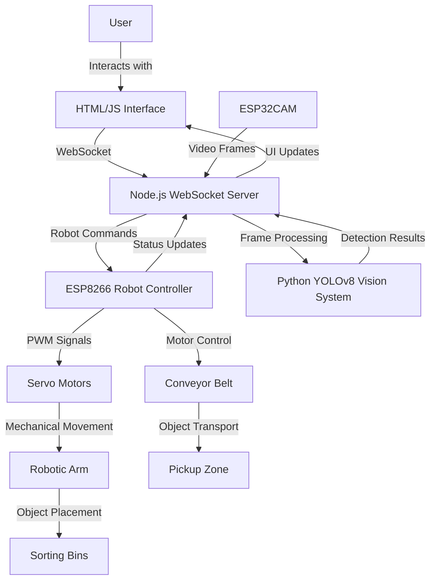
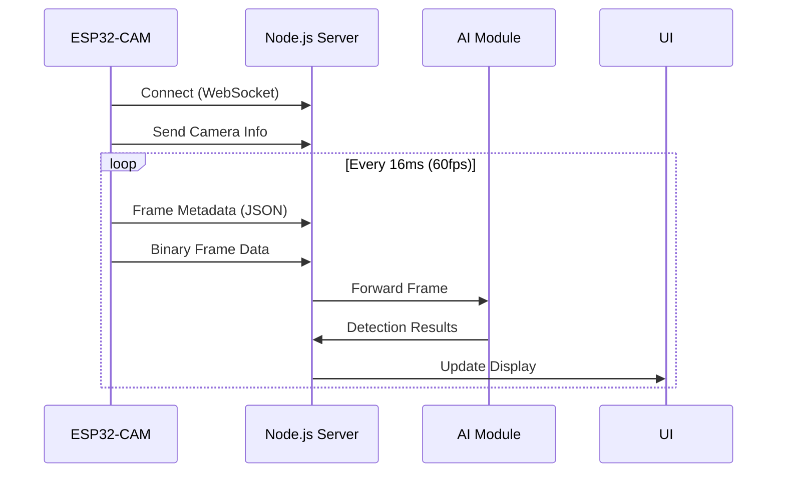
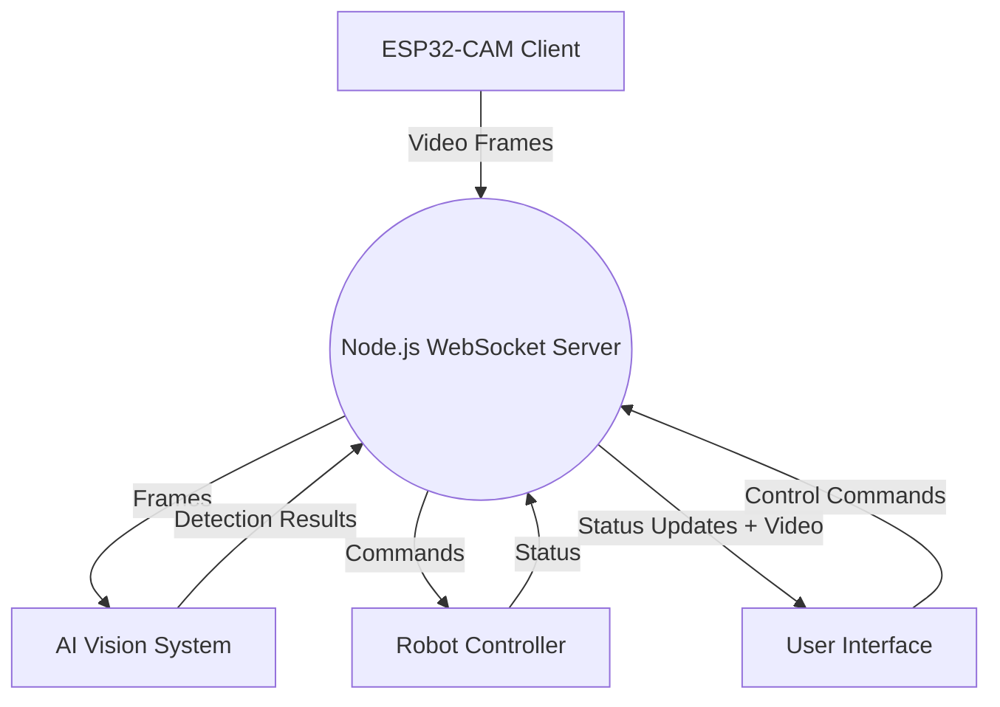
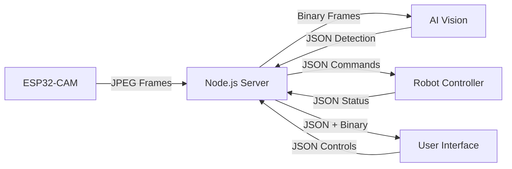

# Smart IoT Robotic Arm for Automated Object Sorting

## 1. Introduction
This project presents an **AI-powered IoT robotic arm** designed for automated object sorting. The system integrates **Arduino** for hardware control, **Node.js** for real-time communication, and **YOLOv8** for object detection and classification. The objective is to develop an intelligent sorting mechanism that utilizes machine learning for decision-making and a robotic system for physical execution.

## 2. Objectives
The primary goals of this project are:
- **Automated Object Sorting**: Develop an autonomous robotic system capable of sorting objects based on size and color.
- **Real-time Image Processing**: Utilize an ESP32-CAM for object detection and classification.
- **AI-Powered Decision Making**: Implement YOLOv8 models for intelligent sorting.
- **IoT Communication**: Enable seamless data exchange between hardware and software components using WebSockets.
- **User Interface for Remote Operation**: Develop an interactive dashboard for monitoring and controlling the robotic arm.

## 3. System Components
### **3.1 Hardware**
| Component         | Function |
|------------------|----------|
| **ESP32-CAM**    | Captures images of objects at 60 FPS (352x288 resolution) to analyze their size and color. Connected via WiFi and WebSockets to stream video frames in real-time. |
| **Conveyor Belt**| Moves objects for automated processing with speed control through PWM signals. |
| **Robotic Arm**  | 4-DOF arm with servo motors for sorting objects into designated bins based on AI classification. |
| **Servo Motors** | Four servos (channels 0-3) control base rotation, arm segments, and gripper with precise angular positioning. |
| **Wi-Fi Module** | Built into the ESP32, facilitates IoT-based communication with 2.4GHz WiFi connectivity. |

### **3.2 Software**
| Software Component   | Description |
|---------------------|-------------|
| **Node.js Server** | Serves as the central hub for all communications, handling WebSocket connections from the ESP32-CAM, AI module, user interface, and robot controller. Runs on port 3000. |
| **WebSocket Communication** | Ensures real-time communication between hardware and software components with different client types (camera, robot, AI, UI) connected simultaneously. |
| **Python AI Vision System** | Utilizes YOLOv8 model for object detection and color-based classification using HSV color space analysis. |
| **HTML/JavaScript UI** | Provides an interactive front-end for users with live camera feed, object detection visualization, and robot control. |

## 4. Technical Architecture

## 5. System Components in Detail

### 5.1 ESP32-CAM Module
The ESP32-CAM serves as the visual input for our system, configured to capture JPEG images at 60 frames per second with 352×288 resolution. It connects to the server via WebSockets and streams both metadata and binary frame data.

**Key Features:**
- Streams JPEG frames at 60 FPS with 352×288 resolution
- Lightweight metadata format for efficient communication
- Automatic reconnection handling for network reliability
- Camera identification for multi-camera setup support

### 5.2 AI Vision System
The Python-based AI system employs YOLOv8 for general object detection and custom HSV color-based detection for sorting by color (red, green, blue).

**Capabilities:**
- Object detection with confidence thresholds
- Color classification using HSV color space analysis
- Positional tracking for robotic arm guidance
- Real-time processing at ~10 FPS

### 5.3 Node.js WebSocket Server
The central communication hub manages connections between all system components:

**Features:**
- Multi-client type management (camera, robot, AI, UI)
- Binary and JSON message handling
- Automatic reconnection support
- Frame buffering and distribution
- Detection result processing

### 5.4 Robotic Control System
The sorting mechanism is powered by a 4-DOF robotic arm with precise servo control:

**Movement Capabilities:**
- Base rotation (0-180°)
- Two-segment arm positioning
- Gripper control for object manipulation
- Sequence-based movement patterns

**Sorting Logic:**
- Red objects: Sorted to right position (180°)
- Green objects: Sorted to middle position (90°)
- Blue objects: Sorted to left position (0°)

### 5.5 User Interface
The HTML/JavaScript interface provides monitoring and control capabilities:

**Features:**
- Live video feed from ESP32-CAM
- Object detection visualization with bounding boxes
- Manual and automatic control modes
- System status monitoring
- Connection status indicators

## 6. Data Flow

## 7. Current Progress

### 7.1 Completed Components
- ✅ ESP32-CAM video streaming implementation
- ✅ WebSocket server for real-time communication
- ✅ YOLOv8 AI vision integration
- ✅ Color-based object detection

### 7.2 In Development
- 🔄 Robotic arm movement sequence optimization
- 🔄 User interface enhancements
- 🔄 Multi-object sorting logic

### 7.3 Future Enhancements
- 📝 Object size-based sorting
- 📝 Machine learning for custom object recognition
- 📝 Mobile application control interface
- 📝 Database integration for sorting analytics

## 8. Technical Specifications

### 8.1 Communication Protocols
- **WebSockets**: Primary real-time communication using ws library
- **HTTP**: For initial connections and static resources

### 8.2 Hardware Requirements
- **ESP32-CAM**: AI-Thinker module with OV2640 camera
- **ESP8266**: For robot control
- **Servo Motors**: SG90 or MG996R servos (4x)
- **Power Supply**: 5V/3A for logic, 6-12V for motors

### 8.3 Software Dependencies
- **Node.js**: v14.0.0 or higher
- **Python**: v3.8 or higher with Ultralytics YOLOv8
- **Libraries**: ws, express, ultralytics, OpenCV
- **Arduino**: ESP32 and ESP8266 board definitions

## 9. Getting Started

### 9.1 Setting Up the Environment
1. Clone the repository
2. Install Node.js dependencies with `npm install`
3. Install Python dependencies with `pip install ultralytics opencv-python pillow websocket-client`

### 9.2 Hardware Setup
1. Flash ESP32-CAM with the provided Arduino code
2. Connect servo motors to ESP8266 following the pin mapping in the code
3. Power up the system with appropriate voltage levels

### 9.3 Running the System
1. Start the Node.js server with `node index.js`
2. Open the web interface at http://localhost:3000
3. Ensure all components show connected status in the UI
4. Begin operation in either manual or automatic mode

