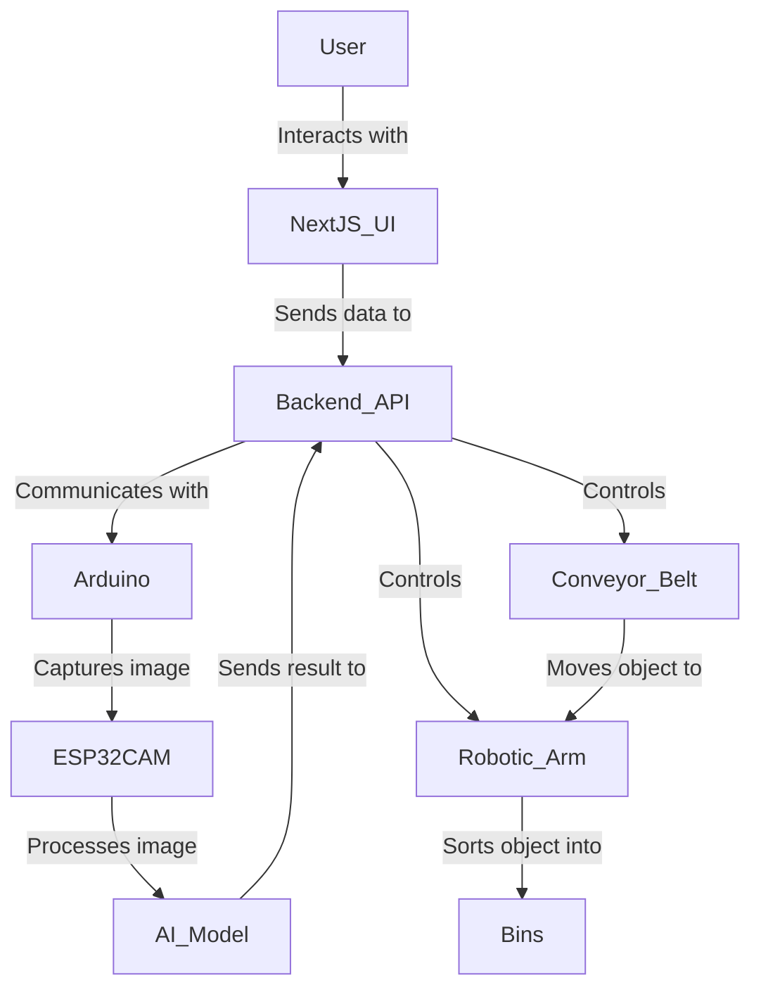

# Smart IoT Robotic Arm for Automated Object Sorting

## 1. Introduction
This project presents an **AI-powered IoT robotic arm** designed for automated object sorting. The system integrates **Arduino** for hardware control, **Next.js** for a user interface, and **Hugging Face AI models** for real-time object classification. The objective is to develop an intelligent sorting mechanism that utilizes machine learning for decision-making and a robotic system for physical execution.

## 2. Objectives
The primary goals of this project are:
- **Automated Object Sorting**: Develop an autonomous robotic system capable of sorting objects based on size and color.
- **Real-time Image Processing**: Utilize an ESP32-CAM for object detection and classification.
- **AI-Powered Decision Making**: Implement Hugging Face models for intelligent sorting.
- **IoT Communication**: Enable seamless data exchange between hardware and software components using WebSockets/MQTT.
- **User Interface for Remote Operation**: Develop a Next.js dashboard for monitoring and controlling the robotic arm.

## 3. System Components
### **3.1 Hardware**
| Component         | Function |
|------------------|----------|
| **ESP32-CAM**    | Captures images of objects to analyze their size and color. |
| **Conveyor Belt**| Moves objects for automated processing. |
| **Robotic Arm**  | Sorts objects into designated bins based on AI classification. |
| **Servo Motors** | Provides precise movements for the robotic arm. |
| **Wi-Fi Module** | Facilitates IoT-based communication. |

### **3.2 Software**
| Software Component   | Description |
|---------------------|-------------|
| **Next.js (React Framework)** | Provides an interactive front-end for users. |
| **Node.js API** | Handles data communication and system logic. |
| **Hugging Face AI Models** | Processes image data and classifies objects. |
| **Firebase** | Stores system data and user authentication details. |
| **WebSockets/MQTT** | Ensures real-time communication between hardware and software. |

## 4. System Architecture


## 5. Installation & Setup
### **5.1 Hardware Setup**
1. Assemble the **conveyor belt system**.
2. Connect **ESP32-CAM** for image acquisition.
3. Integrate **servo motors** for robotic arm movement.
4. Configure **Wi-Fi connectivity** for data transmission.

### **5.2 Software Setup**
#### **Clone the Repository**
```sh
git clone https://github.com/your-username/smart-iot-arm.git
cd smart-iot-arm
```
#### **Arduino Configuration**
1. Install **Arduino IDE** and required ESP32/ESP8266 board libraries.
2. Load firmware for motor and camera control.
3. Ensure Wi-Fi credentials are correctly configured.

#### **Next.js UI Setup**
```sh
cd frontend
npm install
npm run dev
```
#### **AI Model Configuration**
1. Register on [Hugging Face](https://huggingface.co/) and obtain an API key.
2. Modify the `.env.local` file:
```env
HUGGINGFACE_API_KEY=your_key_here
```

## 6. System Operation
1. **Power on the system** and establish Wi-Fi connectivity.
2. **Log in to the Next.js dashboard** to monitor real-time operations.
3. **The ESP32-CAM captures and transmits object images**.
4. **The AI model processes the images** and classifies objects.
5. **The conveyor belt moves objects** towards the robotic arm.
6. **The robotic arm sorts objects** into designated bins based on classification results.

## 7. Performance Metrics
### **Accuracy of AI Classification**
| Object Type | Model Accuracy (%) |
|------------|------------------|
| Red Small Object | 95% |
| Blue Medium Object | 92% |
| Green Large Object | 89% |

### **System Latency**
| Process | Time Taken (ms) |
|---------|---------------|
| Image Capture | 150ms |
| AI Processing | 300ms |
| Sorting Execution | 500ms |

## 8. Troubleshooting
- **Wi-Fi Connectivity Issues**: Verify SSID and password configurations.
- **ESP32-CAM Malfunction**: Ensure correct wiring and power supply.
- **Slow AI Processing**: Optimize the AI model or increase network bandwidth.
- **Conveyor Belt Not Moving**: Check motor connections and power source.
- **Robotic Arm Not Responding**: Calibrate servo motors and verify control signals.

## 9. Academic Contribution
This project contributes to the field of **IoT-based automation and AI-integrated robotics** by demonstrating how **machine learning models** can enhance real-world robotic systems. The integration of **AI-driven object classification with mechanical sorting mechanisms** showcases advancements in **automated logistics and smart manufacturing**.

## 10. Conclusion
This project successfully integrates **AI-powered object classification** with **robotic automation** to achieve **efficient and intelligent sorting**. Future work includes expanding AI models for enhanced accuracy and implementing edge computing for faster processing.

## 11. References
- Arduino Documentation: [https://www.arduino.cc/reference](https://www.arduino.cc/reference)
- Next.js Documentation: [https://nextjs.org/docs](https://nextjs.org/docs)
- Hugging Face AI Models: [https://huggingface.co/models](https://huggingface.co/models)

