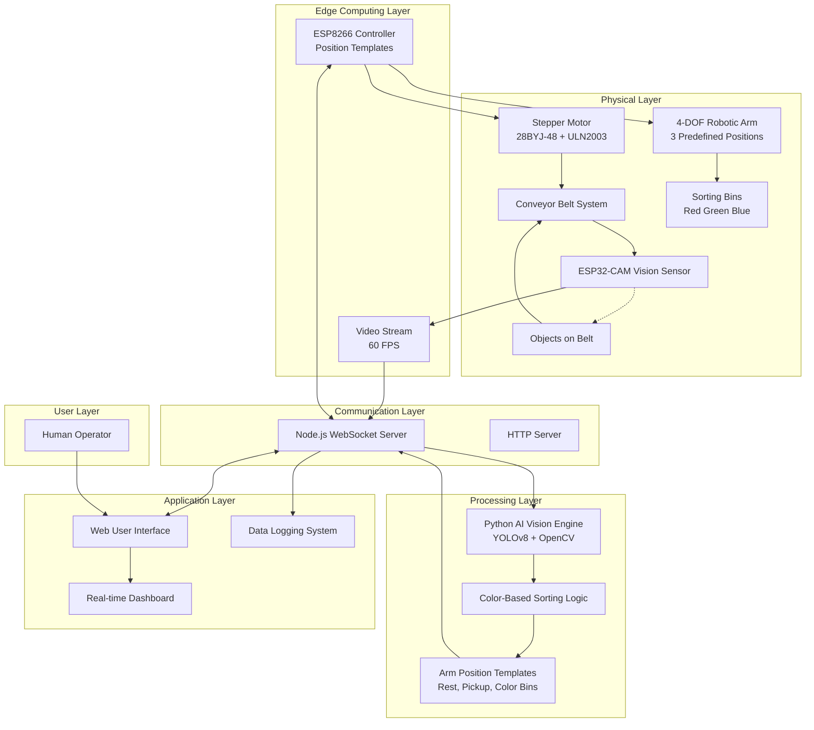

# ARM Robot IoT System Architecture

```mermaid
graph TB
    subgraph Physical["Physical Layer"]
        StepperMotor["Stepper Motor<br/>28BYJ-48 + ULN2003"]
        ConveyorBelt["Conveyor Belt System"]
        Objects["Objects on Belt"]
        ESP32CAM["ESP32-CAM Vision Sensor"]
        RoboticArm["4-DOF Robotic Arm<br/>3 Predefined Positions"]
        SortingBins["Sorting Bins<br/>Red Green Blue"]
        
        Objects --> ConveyorBelt
        StepperMotor --> ConveyorBelt
        ConveyorBelt --> ESP32CAM
        ESP32CAM -.-> Objects
        RoboticArm --> SortingBins
    end
    
    subgraph Edge["Edge Computing Layer"]
        ESP8266["ESP8266 Controller<br/>Position Templates"]
        CameraStream["Video Stream<br/>60 FPS"]
        
        ESP32CAM --> CameraStream
        ESP8266 --> StepperMotor
        ESP8266 --> RoboticArm
    end
    
    subgraph Communication["Communication Layer"]
        WebSocketServer["Node.js WebSocket Server"]
        HTTPServer["HTTP Server"]
        
        CameraStream --> WebSocketServer
        ESP8266 <--> WebSocketServer
    end
    
    subgraph Processing["Processing Layer"]
        AIVision["Python AI Vision Engine<br/>YOLOv8 + OpenCV"]
        DecisionEngine["Color-Based Sorting Logic"]
        PositionTemplates["Arm Position Templates<br/>Rest, Pickup, Color Bins"]
        
        WebSocketServer --> AIVision
        AIVision --> DecisionEngine
        DecisionEngine --> PositionTemplates
        PositionTemplates --> WebSocketServer
    end
    
    subgraph Application["Application Layer"]
        WebUI["Web User Interface"]
        DataLogger["Data Logging System"]
        Dashboard["Real-time Dashboard"]
        
        WebSocketServer <--> WebUI
        WebSocketServer --> DataLogger
        WebUI --> Dashboard
    end
    
    subgraph User["User Layer"]
        Operator["Human Operator"]
        Operator --> WebUI
    end
```
