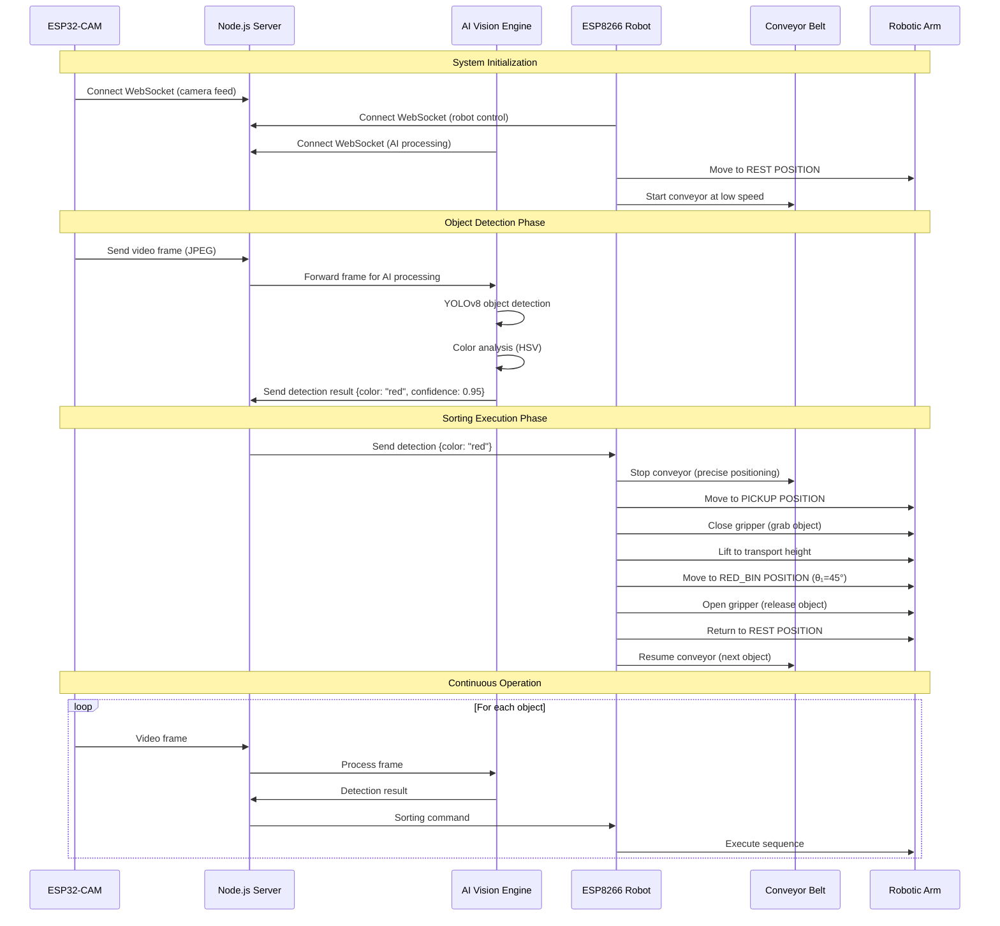

# System Operation Flow with Predefined Positions

## Complete Sorting Workflow



## Position Templates in ESP8266

### Arm Position Definitions:
```cpp
struct ArmPosition {
  int base;      // Joint 0: Base rotation (0-180°)
  int shoulder;  // Joint 1: Shoulder angle
  int elbow;     // Joint 2: Elbow angle  
  int gripper;   // Joint 3: Gripper state
};

// Template positions stored in ESP8266 memory
ArmPosition restPosition = {90, 90, 45, 0};        // Safe home
ArmPosition pickupPosition = {90, 60, 120, 0};     // Object pickup
ArmPosition redBinPosition = {45, 90, 90, 180};    // Red sorting
ArmPosition greenBinPosition = {90, 90, 90, 180};  // Green sorting  
ArmPosition blueBinPosition = {135, 90, 90, 180};  // Blue sorting
```

## WebSocket Communication Protocol

### Detection Message Format:
```json
{
  "detection": {
    "color": "red|green|blue|unknown",
    "confidence": 0.95,
    "timestamp": "2025-06-22T10:30:45.123Z"
  }
}
```

### Robot Status Message:
```json
{
  "device": "robot_arm_conveyor",
  "conveyor": {
    "running": true,
    "stepsPerSecond": 15,
    "direction": 1,
    "type": "stepper"
  },
  "armPosition": {
    "base": 90,
    "shoulder": 90,
    "elbow": 45,
    "gripper": 0
  },
  "lastDetectedColor": "red"
}
```

### Conveyor Control Commands:
```json
{
  "conveyor": {
    "stepsPerSecond": 15,
    "direction": 1
  }
}
```

### Arm Position Commands:
```json
{
  "armPosition": "rest|pickup|red_bin|green_bin|blue_bin"
}
```

## Stepper Motor Control

### Advantages over DC Motor:
- **Precise Positioning**: Step-by-step control eliminates need for encoders
- **Repeatable Motion**: Consistent belt positioning for object pickup
- **Low Speed Stability**: Excellent performance at slow speeds
- **Simple Control**: No PID tuning required
- **Cost Effective**: Cheaper than DC motor + encoder systems

### Speed Control:
- **Range**: 5-50 steps/second
- **Resolution**: 2048 steps per revolution
- **Positioning**: ±1 step accuracy (~0.18° precision)
- **Control Method**: Variable delay between steps
